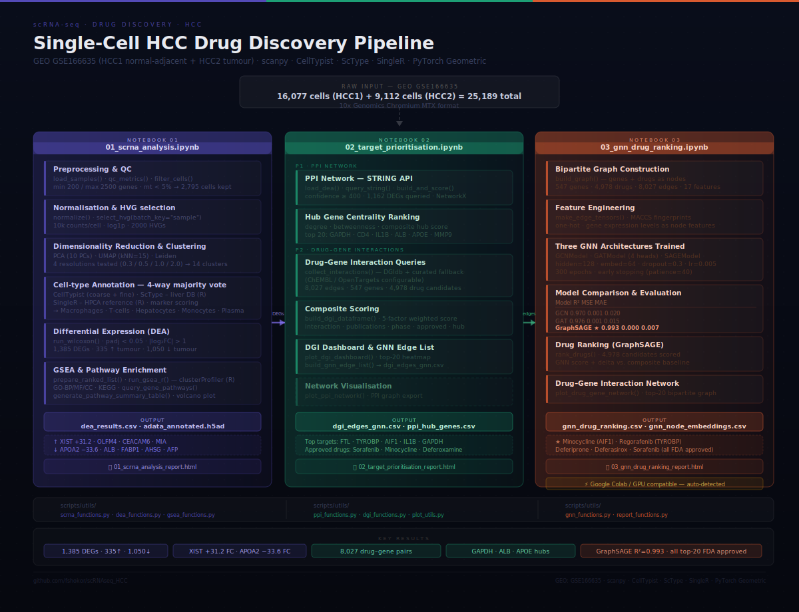

# Single-cell RNA-seq Analysis of Hepatocellular Carcinoma (HCC)

This project reproduces and explores key concepts from a recent study on integrating single-cell RNA sequencing (scRNA-seq) with computational approaches to better understand hepatocellular carcinoma (HCC). The analysis focuses on dissecting tumor heterogeneity, characterizing the tumor microenvironment, and identifying potential therapeutic targets.

HCC is a highly heterogeneous and aggressive cancer, where bulk RNA-seq fails to capture the complexity of cellular populations. Using single-cell analysis, this project aims to provide a high-resolution view of tumor biology and reproduce core analytical steps inspired by the reference study .

---

## Pipeline



The pipeline runs in three main notebooks, each producing a human-readable
HTML report alongside its analytical outputs:

| Notebook | What it does |
|----------|-------------|
| **01 · scRNA-seq Analysis** | QC, normalisation, UMAP clustering, 4-way cell-type annotation, DEA, GSEA |
| **02 · Target Prioritisation** | PPI hub gene network (STRING), survival filter (TCGA-LIHC), drug–gene interactions (DGIdb, ChEMBL, OpenTargets) |
| **03 · GNN Drug Ranking** | Trains GCN / GAT / GraphSAGE on the interaction graph, re-scores all drug–gene pairs, produces a ranked repurposing list |

---

## Quick start

### 1 — Clone

```bash
git clone https://github.com/fshokor/HCC_DD.git
cd HCC_DD
```

### 2 — Environment

```bash
# CPU (sufficient for notebooks 01–02)
conda env create -f env/environment.yml
conda activate hcc_drug_discovery

# GPU (CUDA 12.1, recommended for notebook 03)
conda env create -f env/environment_gpu.yml
conda activate hcc_drug_discovery
```

**R packages** (required for cell-type annotation and GSEA in notebook 01):

```bash
Rscript env/r_packages.R
```

**Key dependencies:**

| Package | Version | Purpose |
|---------|---------|---------|
| scanpy | ≥ 1.9 | scRNA-seq analysis |
| celltypist | ≥ 1.6 | Automated cell-type annotation |
| torch | ≥ 2.0 | GNN training |
| torch-geometric | ≥ 2.4 | Graph neural networks |
| rpy2 | ≥ 3.5 | Python ↔ R bridge |
| networkx | ≥ 3.0 | PPI network construction |
| numpy | < 2.0 | (pinned for torch-geometric compatibility) |

### 3 — Download data

```bash
python scripts/data_download.py
```

Downloads GSE166635 (~204 MB) from NCBI GEO, extracts the HCC1 (normal-adjacent)
and HCC2 (tumour) 10x Genomics MTX files, and writes `paths.py` at the repo root.
All notebooks import paths from this file automatically.

### 4 — Test the installation

```bash
python scripts/run_pipeline_test.py
```

Runs the full scRNA-seq pipeline (QC → clustering → annotation) using Python-only
methods — no R required. Exits with code 0 on success and produces four output
files in `results/`: a UMAP figure, cluster summary CSV, and annotated `.h5ad`.
Use this to verify your environment before running the full notebooks.

### 5 — Run the pipeline

Open JupyterLab and run the notebooks in order:

```bash
jupyter lab
```

```
01_scrna_analysis.ipynb   →   02_target_prioritisation.ipynb   →   03_gnn_drug_ranking.ipynb
```

> **Notebook 03 on Google Colab (GPU):**
> 1. Upload `results/tables/dgi_edges_gnn.csv` via Files → Upload
> 2. Open `notebooks/03_gnn_drug_ranking.ipynb` in Colab
> 3. Runtime → Change runtime type → **T4 GPU**
> 4. Run all — Colab mode is auto-detected, PyG installs automatically

---

## Notebook guide

| Notebook | Input | Key outputs | Logic script |
|----------|-------|-------------|-------------|
| `01_scrna_analysis.ipynb` | `data/raw/HCC1,HCC2/` | `adata_annotated.h5ad` · `dea_results.csv` · `gsea_*.csv` · figures · HTML report | `scrna_functions.py` · `dea_functions.py` · `gsea_functions.py` |
| `02_target_prioritisation.ipynb` | `dea_results.csv` | `hub_genes.csv` · `survival_filtered_genes.csv` · `dgi_edges_gnn.csv` · `dgi_summary_dashboard.png` · HTML report | `ppi_functions.py` · `survival_functions.py` · `dgi_functions.py` |
| `03_gnn_drug_ranking.ipynb` | `dgi_edges_gnn.csv` | `gnn_drug_ranking.csv` · `gcn_best.pt` · `drug_gene_network.png` · HTML report | `gnn_functions.py` |

Each notebook contains only configuration and single-line function calls.
All analysis logic lives in the corresponding `scripts/*_functions.py` file,
making it independently testable and reusable.

---

## References
Wang et al. (2025) — *Integrating single-cell RNA sequencing and artificial intelligence for multitargeted drug design for combating resistance in liver cancer.* npj Precision Oncology 9:309. [doi:10.1038/s41698-025-00952-3](https://doi.org/10.1038/s41698-025-00952-3)

---

## Licence

MIT — see [LICENSE](LICENSE) for details.
